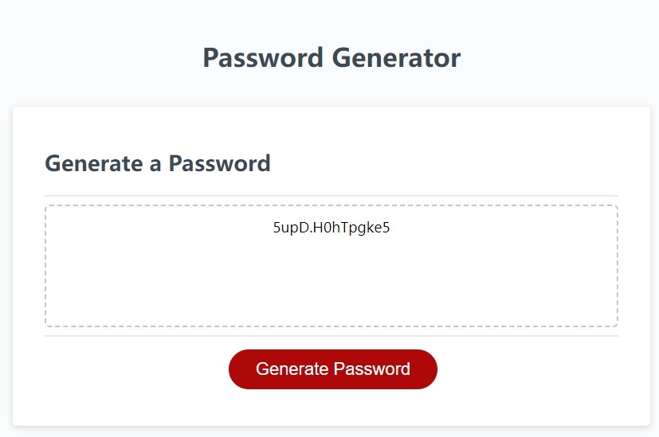

# Module Challenge – Password Generator
## Description
This project is to create an application for users to generate a random password based on their criteria – whether to include special characters, numeric characters or uppercase characters, on top of lowercase letters.

Having watched the instructor’s demo, I knew first off I had to set some ‘boundaries’ before users can choose password options, which was the easiest part. So I modified the text for prompt and confirm methods in order for better user experience. 

The most difficult and important part of the project for me is to work out the process of password generation, so that the functions can be performed following my logic. I had to pause and wait till the next day to rethink the conditions in the function. Including the password options in the condition in particular was most time-consuming, because I kept thinking how to make the popup for user and how to add the character arrays to the existing array if it’s ‘true’. Initially I used the concat() method but the newly created array would be difficult to manage. Luckily the push() method occurred to me so I didn’t have to create variables for different combinations of password options.

One thing I’ve learned more about this time was the use Math.floor() and Math.random() – the ‘*array.length’ part started to make sense to me. This function was the first to be written as a result. With the help of an article in GeeksforGeeks (credit below), using charAt() helped me modify the starter code and ensure the generate button to work properly.

After many times of testing, I was glad that the push() method allowed me to finish the project quicker than expected. However, I know what could be done better. I need to learn more about DOM. Without the starter code, I wouldn’t be able to connect the button in the script with HTML. Also, I didn’t add addition criteria to avoid repeating characters in the password string. I will look at the replace() method in my own time and go beyond this module challenge.

Link to the repository:
https://github.com/leesoohang/module5-password-generator.git

Link to the live application:
https://leesoohang.github.io/module5-password-generator

## Installation
N/A

## Usage
The application can be found as ‘index.html’ under the parent folder in the repository alongside the script, the stylesheet and screenshot of the password demo with all 4 password options included:

## Credits
JavaScript Essential Training by Morten Rand-Hendriksen on LinkedIn Learning: 

https://www.linkedin.com/learning-login/share?account=74653818&forceAccount=false&redirect=https%3A%2F%2Fwww.linkedin.com%2Flearning%2Fjavascript-essential-training%3Ftrk%3Dshare_ent_url%26shareId%3DokISIJTORMuVS3bcmK5Lbw%253D%253D

How to Generate a Random Password using JavaScript? – GeeksforGeeks:

https://www.geeksforgeeks.org/how-to-generate-a-random-password-using-javascript/

JavaScript Tutorial on W3Schools:

https://www.w3schools.com/js/default.asp
